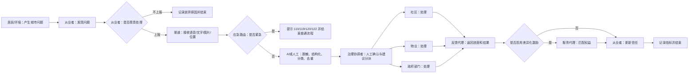

# 行为图

## 1 研究级行为链

这是一张类型级有向无环图。多日持续参与通过“每轮加载新问题并读取上一轮信任状态”实现，不在单轮行为图中画回边，符合玉兰万象行为图应无环、可达终点的要求。

## 2 事件字段

| 事件 | 来源 → 目标 | 最小字段 |
|---|---|---|
| `IssueObserved` | 居民/环境 → 从业者 | 问题编号、类别、严重度、位置单元 |
| `ReportSubmitted` | 从业者 → 渠道 | 合成主体编号、内容摘要、媒介、位置单元、隐私偏好 |
| `EmergencyReferral` | 应急路由 → 法定渠道提示 | 紧急类别、建议号码、必要位置 |
| `StructuredTicket` | AI/人工 → 治理协调者 | 脱敏摘要、类别、风险、重复组、建议层级 |
| `AssignedTicket` | 治理协调者 → 处置主体 | 工单编号、责任主体、时限、人工确认标记 |
| `Resolution` | 处置主体 → 反馈代理 | 结果、耗时、是否解决、证据摘要 |
| `Feedback` | 反馈代理 → 从业者/服务代理 | 进度、结果、失败原因、可申诉入口 |
| `ServiceReward` | 服务代理 → 从业者 | 权益类型、适配理由、有效期 |
| `TrustUpdate` | 从业者 → 指标记录器 | 更新前后信任、是否愿意再次参与 |

## 3 分支规则

- 从业者上报/放弃：由时间压力、信任、隐私顾虑、渠道耗时、服务需求和公民动机共同决定。
- 应急分支：严重事故、火灾、治安或急救事件必须跳出普通治理工单。
- 处置主体选择：小区门禁/楼栋标识优先物业；社区服务优先社区；市政道路和交通优先政府部门；AI 只建议，治理协调者人工确认。
- 去重：同一位置单元、同类问题和相近时间窗进入同一重复组；保留多人佐证但只生成一个主工单。
- 激励：S3 才发送，优先匹配托管、驿站、换电等服务需求，不以现金或商业派单优待为默认激励。

## 4 S0—S3 图上开关

- S0：渠道为电话/群聊/零散反映；结构化、去重、反馈和激励能力弱。
- S1：打开 AI 脱敏、结构化、分类、去重与建议分派。
- S2：在 S1 上打开责任主体、进度与结果反馈。
- S3：在 S2 上打开按服务需求匹配的激励代理。

除这些开关外，问题、画像、路由责任和终止条件保持一致。
